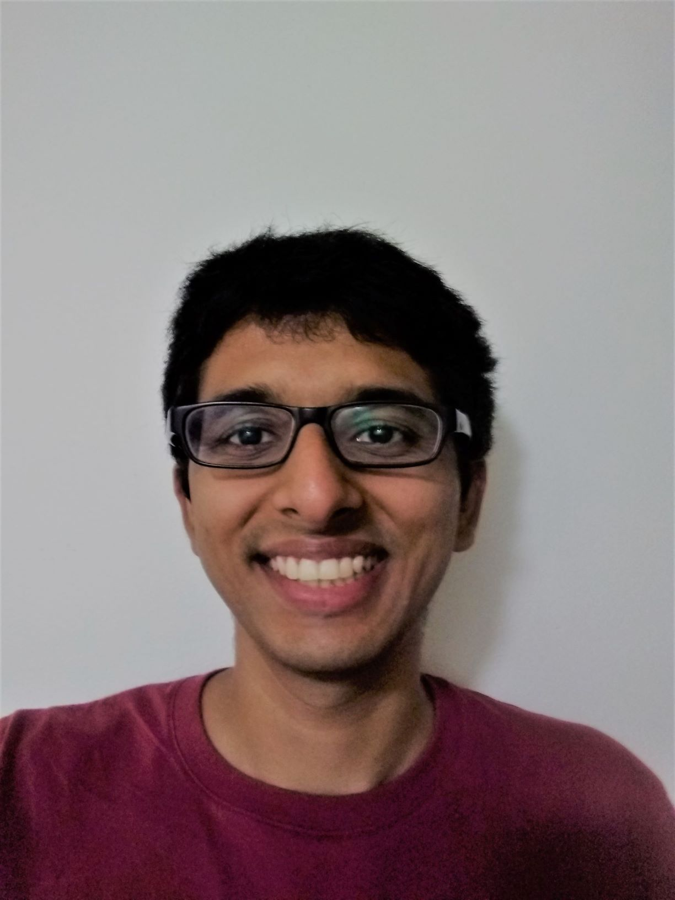

I'm a fourth-year mathematics PhD student at the [University of Illinois at Urbana-Champaign](https://math.illinois.edu/){:target="_blank"}. My interests include enumerative geometry and mirror symmetry; more specifically, I am interested in Gromov-Witten invariants and how they relate to other curve- and sheaf-counting theories. I am currently trying to understand the quantum cohomology of toric varieties. My advisor is [Sheldon Katz](https://faculty.math.illinois.edu/~katz/){:target="_blank"}.

Email: na17 (AT) illinois.edu
